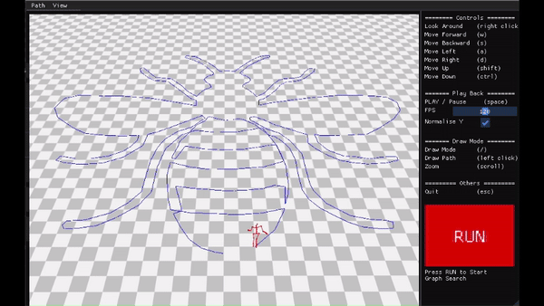
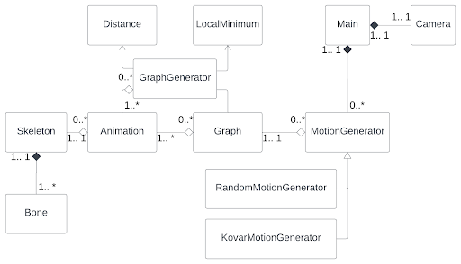

# Animation of Avatars using Human Motion Capture Data

This repository host the code for my bachelor's thesis: "_Animation of Avatars using Human Motion Capture Data_" where I explored the practical implementation of the motion graph algorithm by [Kovar et. al. 2002](https://dl.acm.org/doi/10.1145/566654.566605). The user defines the path, and the program procedurally stitches and blends a database of motion capture data together to procedurally generate motions in real-time. This projects is completely implemented from scratch with **C++**, [OpenGL](https://github.com/glfw/glfw), and [Dear ImGui](https://github.com/ocornut/imgui) to create a complete, interactive, and real-time application. The following lists the key features and engineering decisions within the program. And for those who are interested, the thesis is available [here](./docs/project_report.pdf)!

## Interactive GUI

  

- Camera Controls
- Movement Controls
- Orthographic & Perspective View
- Path Drawing
- Path Saving & Loading
- Playback Controls

## Procedural Path Synthesis - Motion Graphs

  

1. **Build the Graph**  
   - Convert motion capture data into a **directed graph**.  
   - **Nodes** represent choice points, **edges** represent motion clips.  

2. **Detect Transitions**  
   - Identify transition points using the MSE to compute point cloud similarity.  
   - Extract low-error transitions as candidates.  

3. **Create Transitions**  
   - Use **blending** (linear interpolation) to smoothly connect clips.  
   - Ensure constraints (e.g., foot placement) are maintained.  

4. **Prune the Graph**  
   - Keep only **strongly connected components** to ensure seamless motion.
   - Utilize [Tarjan's Algorithm](https://en.wikipedia.org/wiki/Tarjan%27s_strongly_connected_components_algorithm) for O(V+E) runtime complexity

5. **Extract Motion**  
   - Use **graph search (branch-and-bound)** to find motion paths.  
   - Optimize for user constraints (e.g., following a path).  

## Engineering & Implementation Details

  

1. **Technologies Used**  
   - C++, Boost, Dear ImGui, STB
   - OpenGL, GLFW, GLAD, GLM
   - Visual Studio, Windows
  
2. **Performance Optimizations**
   - **Preprocessing** - Precompute the distance calculation and motion graph construction and store it to disk, avoiding costly computation every time.
   - **Subsampling** - Subsample the motion capture data by 1/12 to signifigantly improve motion graph construction without affecting practical motion quality.
   - **Point Cloud Simplification** - Speed up distance computation between point clouds by only comparing key points across the motion capture data.
   - **Constant Path Length** - Reduce the function that locates the point at a certain arclength from linear O(n) to constant O(1) complexity using equal-length control points.
   - **Ablation Analysis** - Performed ablation experiments on the algorithms parameters (e.g. keep ratio, threshold, search depth) to balance the trade-off between runtime peformance and motion quality.

